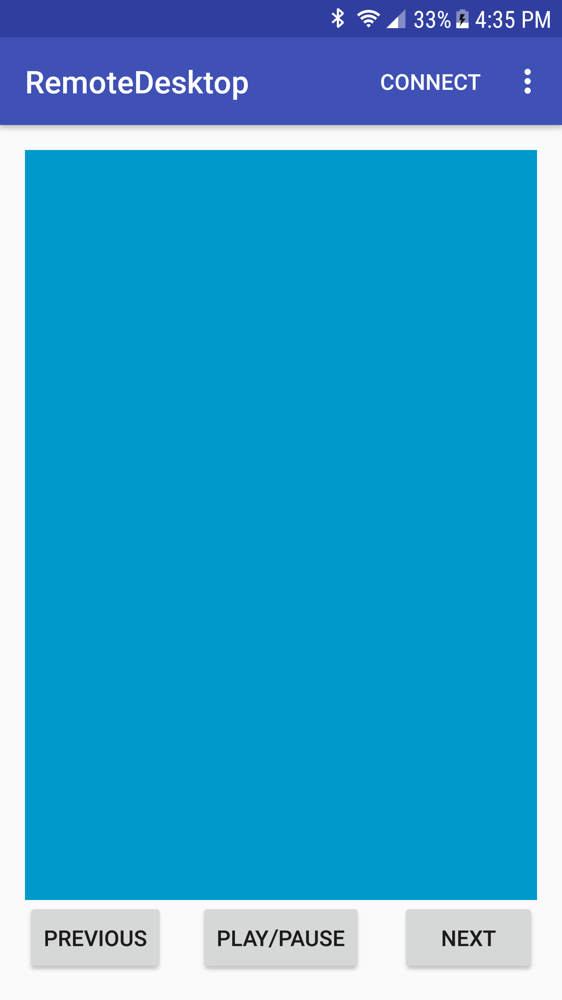

Remote Desktop-used to control your System's cursor with the help of your android phone.

Remote Desktop
===================================

This combination of Android and desktop application is used to control your System's cursor with the help of your Android phone.

Introduction
------------
The app connects to your computer via your internal IP address (currently hard coded in Android app). From there you can move your mouse cursor as well as use your play, next, and previous media buttons from your Android phone. 

Pre-requisites
--------------

- Minimum Android SDK 15

Screenshots
-------------

 

Getting Started
---------------

TODO

Support
-------

If you've found an error in this sample, please file an issue:
https://github.com/doomers/Remote-Desktop/issues

Patches are encouraged, and may be submitted by forking this project and
submitting a pull request through GitHub. Please see CONTRIBUTING.md for more details.

License
-------

MIT License

Copyright (c) 2017 Rahul Tuteja

Permission is hereby granted, free of charge, to any person obtaining a copy
of this software and associated documentation files (the "Software"), to deal
in the Software without restriction, including without limitation the rights
to use, copy, modify, merge, publish, distribute, sublicense, and/or sell
copies of the Software, and to permit persons to whom the Software is
furnished to do so, subject to the following conditions:

The above copyright notice and this permission notice shall be included in all
copies or substantial portions of the Software.

THE SOFTWARE IS PROVIDED "AS IS", WITHOUT WARRANTY OF ANY KIND, EXPRESS OR
IMPLIED, INCLUDING BUT NOT LIMITED TO THE WARRANTIES OF MERCHANTABILITY,
FITNESS FOR A PARTICULAR PURPOSE AND NONINFRINGEMENT. IN NO EVENT SHALL THE
AUTHORS OR COPYRIGHT HOLDERS BE LIABLE FOR ANY CLAIM, DAMAGES OR OTHER
LIABILITY, WHETHER IN AN ACTION OF CONTRACT, TORT OR OTHERWISE, ARISING FROM,
OUT OF OR IN CONNECTION WITH THE SOFTWARE OR THE USE OR OTHER DEALINGS IN THE
SOFTWARE.
